# SkyGuide

## Authentication 

  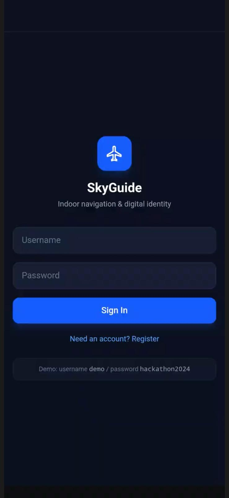
  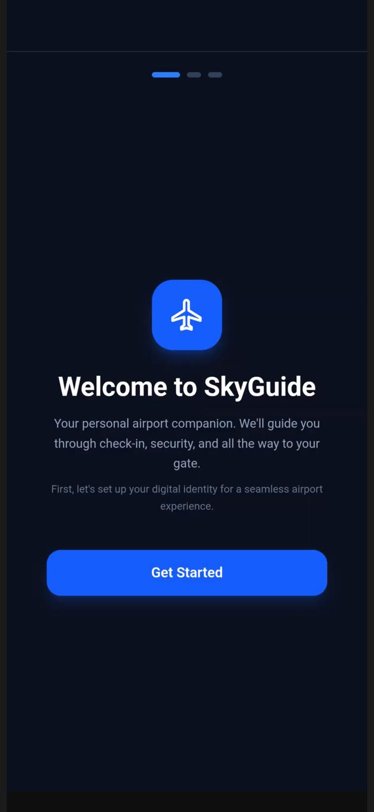

 ## Onboard
> ### Two-step onboarding flow covering biometric identification and document validation, supporting national ID and passport with mock approval

  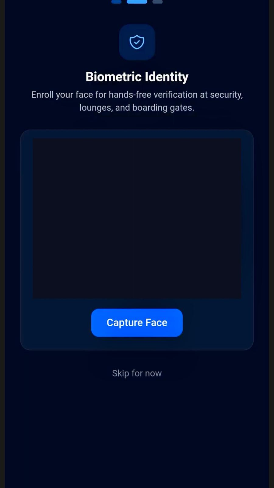
  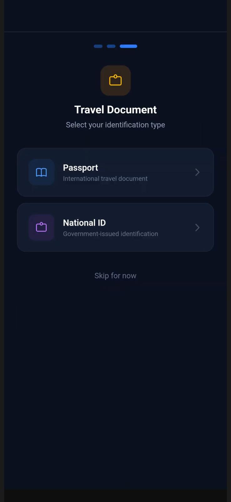
  

> ### Access to the ticket section is protected by per-session identity verification, after which users can add and view their flight tickets.

  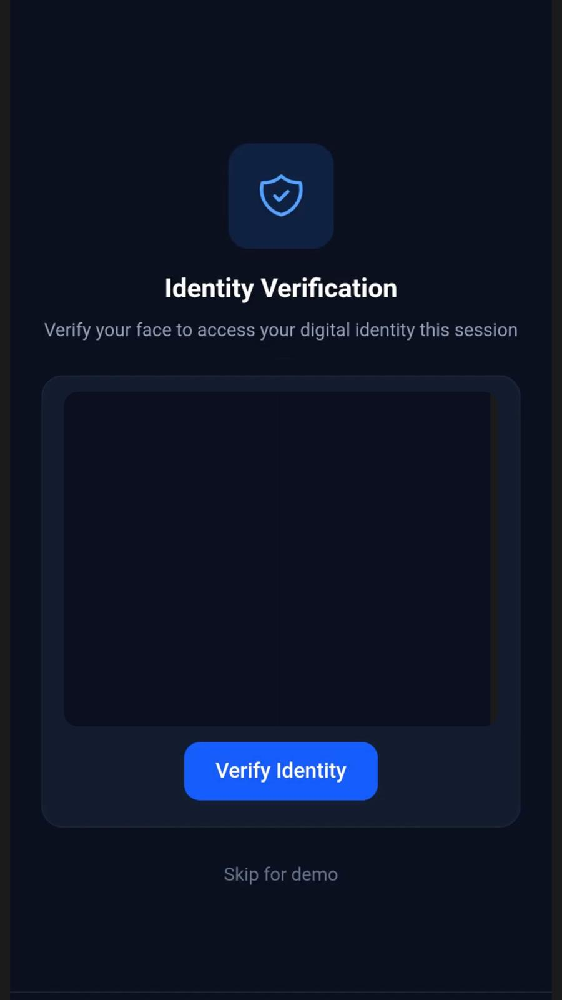
  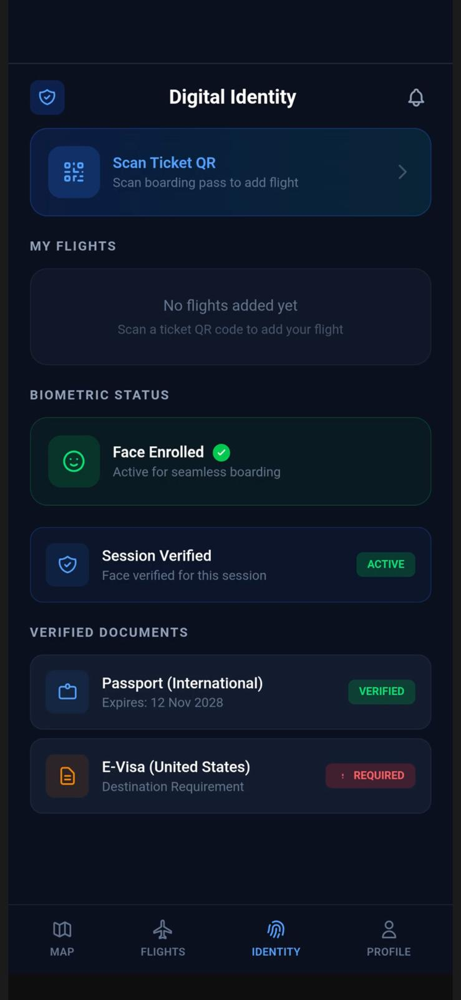
  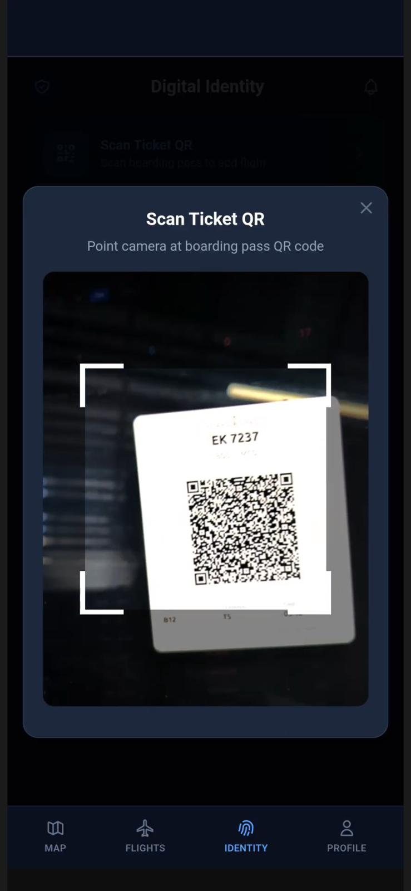
  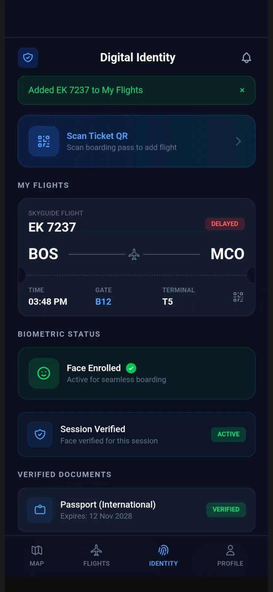

## Profile page

> ### Manage your account and accessibility preferences — toggle and customize haptic feedback intensity or voice navigation to match your needs.

  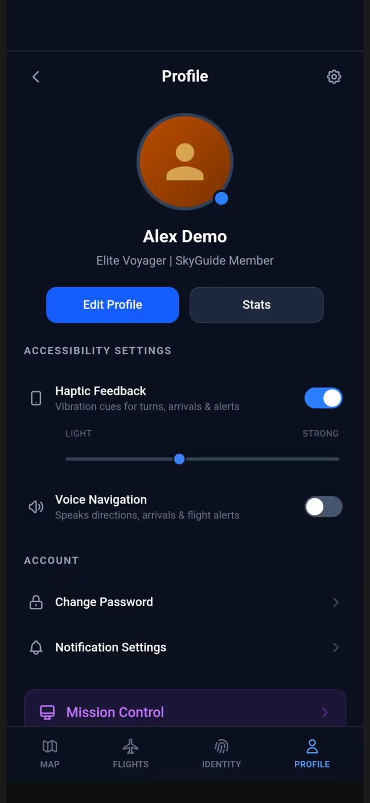

## Map
> ### Searchable indoor airport map with real-time turn-by-turn navigation, displaying the route, next step instructions, and estimated travel time.

  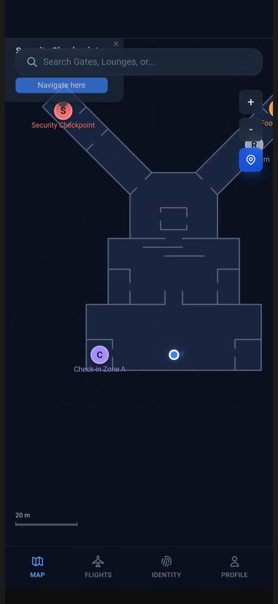
  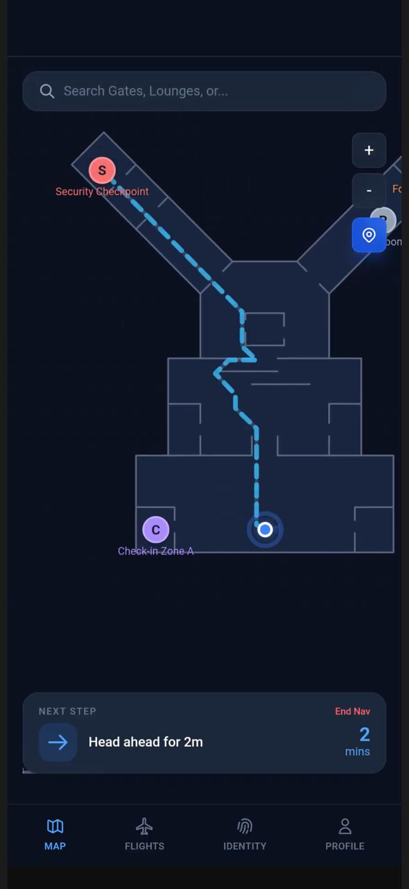

